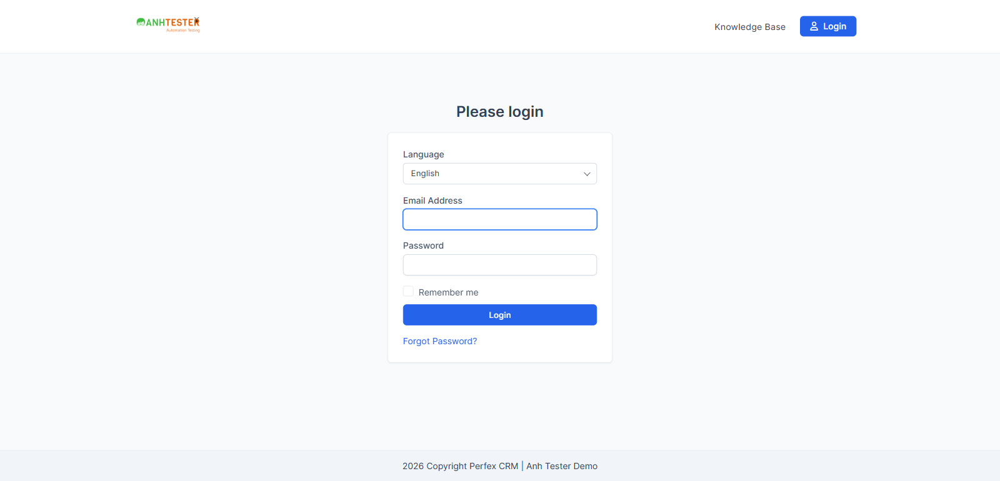

# Execution Report — Đăng nhập (`LOGIN`) · Chạy theo dải TC 001–010

| Thông tin | Nội dung |
|---|---|
| Run ID | run_1790175154 |
| Nền tảng | `web` |
| Nguồn TC | [docs2/docs/testcases/login/web/parts/part_01_web_giao_dien_nhap_lieu.md](../../../../testcases/login/web/parts/part_01_web_giao_dien_nhap_lieu.md) — bản sau `/review-testcases` Mode FIX 23-09-2026 (mốc trước khi sửa `82a814d`, chưa commit) |
| Phạm vi | 10 TC — `CRM_LOGIN_TC_001` → `CRM_LOGIN_TC_010` · loại 0 TC `@Deprecated` |
| Môi trường | `https://crm.anhtester.com` — Anh Tester Demo |
| Build / Version | Không công bố |
| Tài khoản | `admin@example.com` (Admin) — mật khẩu ở `.env`, **không** ghi vào tài liệu |
| Trình duyệt | Chromium qua Playwright MCP, headed, profile sạch (không cookie `crm.anhtester.com` lúc bắt đầu — tương đương cửa sổ ẩn danh), viewport `1600×770` |
| Người thực hiện | KunMan (agent hỗ trợ) |
| Bắt đầu → Kết thúc | 23-09-2026 21:52 → 21:58 (khoảng 6 phút chạy thực, chưa tính thời gian chờ tester đăng nhập) |
| Môi trường dùng chung? | Có — auto-skip TC phá huỷ đang BẬT |

> ⚠️ **Viewport lệch cửa sổ:** đo `innerWidth 1600` > `outerWidth 1554` — mép phải trang (~46px) có thể nằm ngoài tầm nhìn của tester. Không ảnh hưởng kết quả chấm (trang đăng nhập căn giữa, rộng 400px). Theo CLAUDE.md cần hạ `--viewport-size` trong `.mcp.json` rồi khởi động lại. Không resize giữa buổi để giữ điều kiện test.

## 1. Tổng kết

| Trạng thái | Số lượng | Tỷ lệ |
|---|---|---|
| ✅ PASS | 8 | 80.0% |
| ❌ FAIL | 1 | 10.0% |
| ⚠️ BLOCKED | 1 | 10.0% |
| ⏭️ SKIPPED | 0 | 0% |
| **Tổng** | **10** | 100% |

> **Pass rate (không tính SKIPPED):** 8/10 = 80.0%. Không tính TC `@KnownBug` thiết kế để FAIL (TC_004): 8/9 = 88.9%.
>
> **Thứ tự chạy:** 001 → 005, 009, 010, rồi 006 → 008. TC_006–008 cần tester tự đăng nhập bằng mật khẩu thật (agent không được nhập mật khẩu), nên chạy sau cùng. Các TC độc lập với nhau, đổi thứ tự không ảnh hưởng kết quả.

## 2. Kết quả từng TC

| TC ID | Test Scenario | Kết quả | Bước fail | Ghi chú |
|---|---|---|---|---|
| CRM_LOGIN_TC_001 | Mở trang đăng nhập khi chưa có phiên | ✅ PASS | — | URL giữ nguyên, tab `Perfex CRM \| Anh Tester Demo - Login`, tiêu đề `Login` ngay dưới logo. 🔧 mã phản hồi 200, `body` có class `login_admin` |
| CRM_LOGIN_TC_002 | Giao diện trang đăng nhập: đủ thành phần, đúng thứ tự, đúng mặc định | ✅ PASS | — | Bảng kiểm 6/6 mục đạt: thứ tự đúng · 2 ô trống, không có chữ gợi ý · `Remember me` chưa tích, không mờ · nút `Login` nền xanh chữ trắng, rộng 336px = ô nhập · ô Email viền xanh · chỉ 1 nút gửi `Login`, không có nút mạng xã hội. Bước 3: gõ không bấm chuột → `Abc12345` vào ô Email. Evidence: [ảnh mặc định](evidence/CRM_LOGIN_TC_002_giao_dien_mac_dinh.png) |
| CRM_LOGIN_TC_003 | Trang đăng nhập mặc định không có CAPTCHA | ✅ PASS | — | Trang vừa khít 770px, không cần cuộn; không có ô "không phải người máy", ảnh đố hay khung xác minh. 🔧 0 phần tử reCAPTCHA/captcha, 0 `iframe` |
| CRM_LOGIN_TC_004 | Bấm logo trên trang đăng nhập thì về trang chủ công khai | ❌ FAIL | 4 | 🐞 `@KnownBug` — FAIL là kết quả đúng, bug `BUG_login_1787226513_TC004` **vẫn tái hiện**. Bước 2 PASS: con trỏ hình bàn tay, liên kết trỏ `https://crm.anhtester.com/` (đọc từ thuộc tính liên kết — thanh trạng thái của trình duyệt không quan sát được qua công cụ). Xem chi tiết #1 |
| CRM_LOGIN_TC_005 | Mở trang Quên mật khẩu từ liên kết và bằng URL trực tiếp | ✅ PASS | — | Bấm `Forgot Password?` → đúng `/admin/authentication/forgot_password`. Bảng kiểm 5/5: tiêu đề `Forgot Password` · 1 ô `Email Address` trống + nút `Confirm` nền xanh · không có Password/Remember me · trang chỉ có 1 liên kết là logo · logo trỏ `https://crm.anhtester.com/`. Bước 4 (tab mới, URL trực tiếp): giống hệt. 🔧 biểu mẫu `POST` về chính URL, có trường ẩn `csrf_token_name` (32 ký tự), 1 thẻ liên kết |
| CRM_LOGIN_TC_006 | Đăng nhập Admin bằng thông tin hợp lệ thì vào Dashboard | ✅ PASS | — | Bước 2–4 (nhập Email/Password, bấm `Login`) do **tester tự thao tác** trên cửa sổ trình duyệt — agent không được nhập mật khẩu thật. Agent chấm bước 5: dừng ở `https://crm.anhtester.com/admin/`, không có dải báo lỗi, tab `Dashboard`, `Dashboard` đang sáng, menu đủ 14 mục đúng thứ tự, có ảnh đại diện góc trên phải. 🔧 `body` có đủ class `app` `admin` `dashboard` `user-id-2`; mã 303 **chưa kiểm** — công cụ không còn giữ request gửi biểu mẫu sau khi chuyển trang |
| CRM_LOGIN_TC_007 | Desktop: lối đăng xuất duy nhất nằm cuối menu ảnh đại diện | ✅ PASS | — | Bước 1: thanh đầu trang không có `Logout` nào hiện sẵn. Bảng kiểm 3/3: đúng 5 mục `My Profile` → `My Timesheets` → `Edit Profile` → `Language` → `Logout` · `Language` có mũi tên · `Logout` cuối cùng. Đã nhìn ảnh để xác nhận; **không** lưu ảnh vì kéo theo số liệu Dashboard |
| CRM_LOGIN_TC_008 | Không có bộ đếm giờ đang chạy thì bấm Logout là đăng xuất ngay | ⚠️ BLOCKED | Tiền đề | Tiền đề không đạt: danh sách đồng hồ có **2 timer đang chạy**, bắt đầu 23-09-2026 21:25 — trước buổi chạy này, do người khác trên tài khoản Admin dùng chung. Theo TC: ghi BLOCKED, **không** dừng timer của người khác. Xem mục 4 |
| CRM_LOGIN_TC_009 | Bỏ trống cả Email và Password thì hiện đủ 2 thông báo bắt buộc | ✅ PASS | — | Bước 3: nút `Login` không khoá (`disabled=false`, không mờ). Sau khi bấm: trang nạp lại, vẫn ở trang đăng nhập, đúng 2 dải đỏ theo thứ tự `The Password field is required.` → `The Email Address field is required.` |
| CRM_LOGIN_TC_010 | Bỏ trống riêng Email thì chỉ báo thiếu Email | ✅ PASS | — | Biến thể `a` (trống) và `b` (3 khoảng trắng): đều đúng 1 dải `The Email Address field is required.`, không có `Invalid email or password`. Ghi chú `b`: ô `type=email` tự bỏ khoảng trắng nên giá trị gửi đi là rỗng |

## 3. Chi tiết TC FAIL

### FAIL #1 — CRM_LOGIN_TC_004 · Bấm logo trên trang đăng nhập thì về trang chủ công khai

| | |
|---|---|
| REQ ID | REQ-LOGIN-04 |
| Priority | Low |
| Bước fail | Bước 4 — bước 2 PASS |
| **Expected** | Thanh địa chỉ dừng ở `https://crm.anhtester.com/` — trang chủ công khai, **không** phải một trang đăng nhập nào |
| **Actual** | Dừng ở `https://crm.anhtester.com/authentication/login`, tiêu đề tab `Please login` — trang đăng nhập của **cổng khách hàng** (có ô Language, thanh đầu trang có `Knowledge Base` và nút `Login`) |
| Loại | 🐞 `@KnownBug` — TC **thiết kế để FAIL**. Bug `BUG_login_1787226513_TC004` **vẫn còn** trên bản hiện tại |
| Evidence |  |
| Tái hiện được? | Có — khớp đúng mô tả lỗi đã biết trong TC |

## 4. TC BLOCKED

| TC ID | Nguyên nhân chặn | Cần gì để chạy được |
|---|---|---|
| CRM_LOGIN_TC_008 | Tài khoản Admin dùng chung đang có **2 timer chạy**, bắt đầu 23-09-2026 21:25 — trước buổi chạy này, không do agent tạo. Có timer thì bấm `Logout` sẽ hiện hộp xác nhận (đó là kịch bản của TC_031), không kiểm được nhánh "đăng xuất ngay" | Chạy lại khi tài khoản Admin không có timer nào đang chạy, hoặc dùng tài khoản test riêng. **Không** tự dừng timer của người khác. ➡️ **Đã chạy lại ở [`run_1790175621`](../run_1790175621/execution_report.md) → ✅ PASS** (tester đã dừng timer) |

## 5. Dữ liệu đã tạo & dọn dẹp

| Dữ liệu | ID | Nơi tạo | Đã xoá? |
|---|---|---|---|
| _(không có)_ | — | — | — |

> Buổi chạy **không tạo** bản ghi nào. Các lần gửi biểu mẫu sai (TC_009, TC_010) không lưu dữ liệu. Không đụng tới 2 timer của người khác.
>
> ℹ️ Phiên Admin do tester đăng nhập vẫn **đang mở** trên cửa sổ trình duyệt của Playwright — agent không đăng xuất vì còn timer của người khác (đăng xuất sẽ bật hộp xác nhận). Tester tự đăng xuất hoặc đóng trình duyệt khi xong.
>
> 🔒 Không ghi mật khẩu, cookie hay mã chống giả mạo vào report — chỉ ghi hình thái (VD `csrf_token_name` dài 32 ký tự).

## 6. Đề xuất bước tiếp theo

- **FAIL #1 (TC_004)** là lỗi đã biết, bug đã có — **không** tạo bug mới. ✅ Đã ghi `❌ NOT_FIXED` vào Lịch sử retest của [`BUG_login_1787226513_TC004`](../../../../bugs/login/web/BUG_login_1787226513_TC004.md) ngày 23-09-2026 (`/create-bug-report`) — file bug đã được ghi lại từ git mốc `82a814d`
- **TC_008 BLOCKED** → chạy lại khi tài khoản Admin không có timer, hoặc xin tài khoản test riêng để không phụ thuộc người khác
- **TC_006** — phần 🔧 mã 303 chưa kiểm: lần sau bật ghi network trước khi tester bấm `Login`
- **Viewport** — lệch `inner 1600` > `outer 1554`: hạ `--viewport-size` trong `.mcp.json` (VD `1536,770`) hoặc phóng to cửa sổ, rồi khởi động lại Claude Code. Lưu ý bộ TC ghi chuẩn `1600×750`
- Chạy tiếp `CRM_LOGIN_TC_011` → `022` để phủ hết part 01
